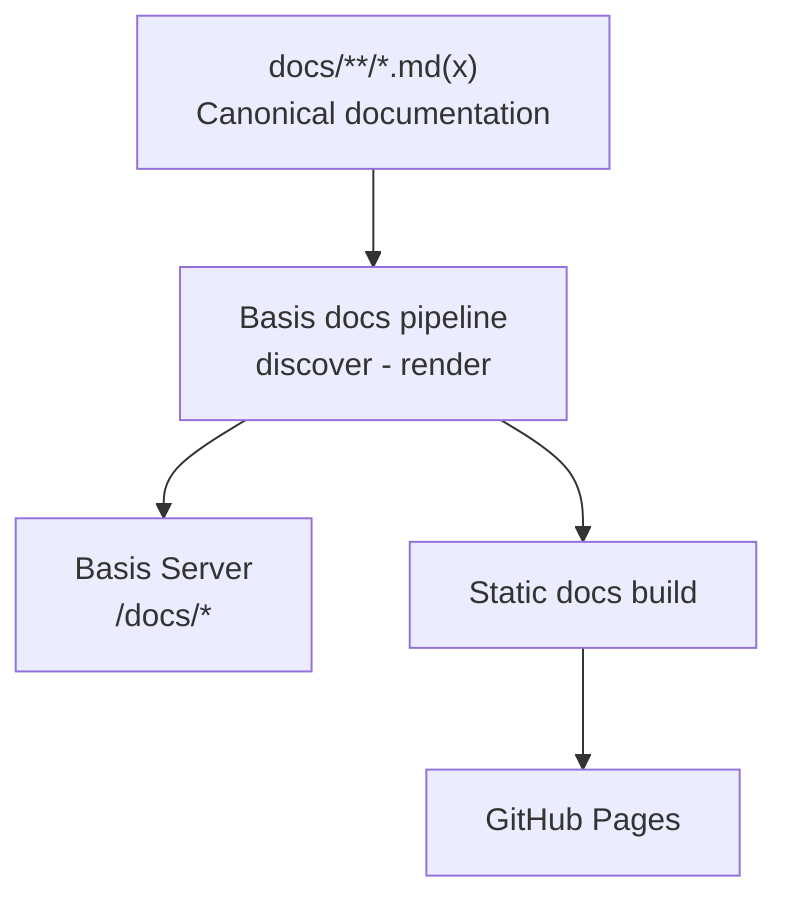

# Architecture

Basis is a Bun-first monorepo distributed as a pinned Git dependency. The root `package.json` is the public facade: consumers import stable source surfaces (`basis/react`, `basis/server`, `basis/logger`, `basis/review`, `basis/configuration`, `basis/eslint`, `basis/stylelint`, `basis/tsconfig/*`) and never reach into workspace paths.

## Invariants

- The consumer surface resolves without Basis-monorepo path aliases or `node_modules/basis/libraries/*` imports.
- Runtime dependencies are declared in the root `dependencies`; host capabilities are declared as `basis.hostDependencies` metadata and validated by the install hook rather than exposed as an imperative API.
- Cross-workspace imports are package-relative.

## Where the detail lives

Workspace `README.md` files remain the precise per-package reference — for example [consumer/README.md](https://github.com/TroyAlford/basis/blob/main/consumer/README.md) for the runtime and install contract, and [libraries/review/README.md](https://github.com/TroyAlford/basis/blob/main/libraries/review/README.md) for review policy. This tree carries the durable, cross-cutting architecture prose and the invariants above.

## System shape

