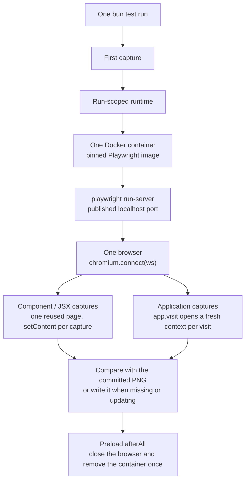

# Visual snapshots

Snapshot tests pin the rendered output of a component or an application page to a committed PNG. `basis/testing` exposes one async helper, `matchScreenshot(subject, hint?, options?)`, with the same shape as Bun's `toMatchSnapshot`: a missing snapshot is written, a changed snapshot throws and leaves `<name>.actual.png` / `<name>.diff.png` beside the baseline, and `--update-snapshots` (or `UPDATE_SNAPSHOTS=1`) rewrites it. The subject is a React element, a Playwright `Page`, or a `Locator`.

A `bun test` run is fast and deterministic because the expensive part — the browser — is paid for once and reused:

- exactly **one Docker container** runs Chromium for the whole run;
- exactly **one browser connection** serves every capture;
- component/JSX snapshots and `app.visit` snapshots share that one browser;
- the runtime starts on the first capture, never per file, test, assertion, visit, or component;
- the testing preload tears it down **once**, when the run ends.

## Lifecycle



The runtime is memoised on `globalThis`, so every test file in the process resolves the same instance. There is no per-file, per-test, or per-capture browser startup; a run that never captures a screenshot never starts Docker at all.

## Component captures

`matchScreenshot(<Button>Save</Button>)` renders the element to a standalone document with `react-dom/server`, inlines Basis's component styles and default theme, and loads it into one reused page with `setContent`. Each capture replaces that page's document, so the page — and the browser behind it — is created once. Playwright round-trips are kept to a minimum: one `evaluate` that waits for fonts and measures the element, then one screenshot.

Components whose meaningful state only exists after mount — the resolved `Await`, a rendered `Mermaid` diagram, a placed `Tooltip` — are captured live through `app.visit` in `visual.live.test.tsx`. Everything else is a static element capture.

## Application captures

`useApplication({ entry })` boots the real server once per run on a free loopback port and waits for readiness. `app.visit(path, options?, fn)` opens a fresh browser context on the shared browser, applies the deterministic network policy, navigates, and runs the callback. Contexts are cheap: they keep server and browser state from leaking between visits without paying for a new browser.

```tsx
import { matchScreenshot, test, useApplication } from 'basis/testing'

test('renders the application', async () => {
  const app = await useApplication({ entry: './src/serve.ts' })

  await app.visit('/deck', async page => {
    await matchScreenshot(page.locator('.deck-builder'))
  })
})
```

## Docker and determinism

Capture always runs in the pinned `mcr.microsoft.com/playwright:v<installed playwright>-noble` image, matching the installed Playwright version, so local development and CI render in the same browser. No host Chromium or operating-system libraries are needed — only a working Docker daemon. The runtime publishes the container's `run-server` to a random localhost port and connects once with `chromium.connect`, exposing the client's loopback so the containerised browser can reach the application server; the container has no fixed name and no host-network assumption.

With no fixed identity, no lock files, no reference counts, and no PID protocols, there is nothing to coordinate between runs: each run owns exactly one container and removes it when it finishes.

## Proving the contract

`libraries/testing/runtime.lifecycle.test.ts` is the benchmark. It generates several test files — dozens of component snapshots, repeated captures within one test, and multiple `app.visit` snapshots — and runs them in one real child `bun test` process. The runtime records its lifecycle events to `BASIS_SNAPSHOT_ACTIVITY_LOG`, and the test asserts **one container start, one browser connection, and one teardown** for the run, reporting the measured runtime.

## Updating snapshots

```sh
bun test --update-snapshots
# or
UPDATE_SNAPSHOTS=1 bun test
```

A committed baseline is only rewritten when the run explicitly updates. A failed or browser-less run never mutates a committed snapshot; a comparison failure writes only the `.actual` / `.diff` artefacts, and stale artefacts are cleared on the next pass. Obsolete snapshots are pruned only while updating, and only for files whose entire suite executed.
